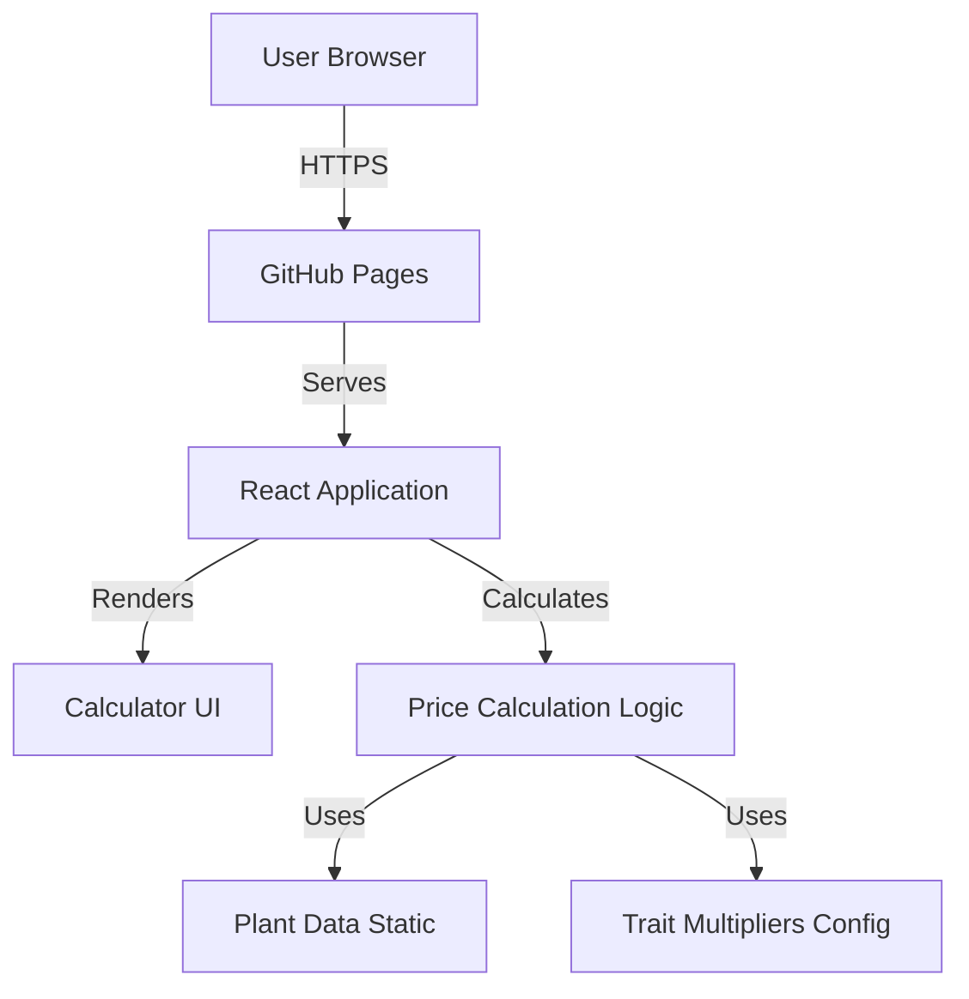

# Design Review: Plant Price Calculator

**Review Date**: 2024
**Reviewer**: AI Assistant
**Document**: `docs/ai/design/feature-plant-price-calculator.md`
**Template**: `docs/ai/design/README.md`
**Related Requirements**: `docs/ai/requirements/feature-plant-price-calculator.md`

## Executive Summary

Design document có cấu trúc tốt và align với template. Kiến trúc phù hợp với requirements (static SPA, no backend). Tuy nhiên, có một số điểm cần cải thiện về diagrams, component interfaces, và một số inconsistencies cần fix.

**Overall Assessment**: ✅ **Good** - Cần một số improvements về diagrams và clarifications

---

## 1. Architecture Overview

### ✅ Mermaid Diagram Present
Diagram hiện tại:


**Đánh giá**: ✅ Diagram có mặt và mô tả đúng high-level architecture

**Gợi ý cải thiện**:
- Có thể thêm component hierarchy diagram để show rõ hơn React component structure
- Có thể thêm data flow diagram để show rõ hơn user interaction flow

### ✅ Key Components
- React Application
- Static Data
- Calculation Engine
- UI Components

**Đánh giá**: ✅ Đầy đủ và rõ ràng

### ✅ Technology Stack
- ReactJS (Vite hoặc CRA)
- styled-components
- GitHub Pages
- TypeScript (khuyến nghị)

**Đánh giá**: ✅ Phù hợp với requirements và constraints

**Gợi ý**: Nên quyết định rõ Vite hay CRA (trong implementation doc đã chọn Vite)

---

## 2. Data Models

### ✅ Plant Data Structure
```typescript
interface Plant {
  name: string;
  basePrice: number;
}
```
**Đánh giá**: ✅ Đơn giản, phù hợp

### ✅ Mutation Types
```typescript
type MutationType = "none" | "gold" | "prismatic";
const mutationMultipliers = { none: 1, gold: 20, prismatic: 50 };
```
**Đánh giá**: ✅ Rõ ràng, align với requirements

### ✅ Trait Configuration
```typescript
const traits: Trait[] = [
  { name: "Dust", multiplier: 10 },
  // ... đầy đủ 8 traits với giá trị đã xác nhận
];
const MAX_TRAIT_MULTIPLIER = 55;
```
**Đánh giá**: ✅ Đã được cập nhật với giá trị cụ thể từ requirements

### ✅ Calculation State
```typescript
interface CalculatorState {
  selectedPlant: Plant | null;
  weight: number;
  mutation: MutationType;
  selectedTraits: string[];
  calculatedPrice: number;
}
```
**Đánh giá**: ✅ Phù hợp với requirements

### ✅ Data Flow
5 bước data flow được mô tả rõ ràng

**Gợi ý cải thiện**: Có thể thêm mermaid diagram cho data flow để visualize rõ hơn

---

## 3. API Design

### ✅ Component Interfaces
Có đầy đủ interfaces cho:
- CalculatorProps
- PlantSelectorProps
- MutationSelectorProps
- TraitSelectorProps
- PriceDisplayProps

**⚠️ Missing**: 
- `WeightInputProps` - không có trong component interfaces section
- Có thể thêm `WeightInputProps` interface

**Gợi ý**:
```typescript
// Weight Input Component
interface WeightInputProps {
  weight: number;
  onWeightChange: (weight: number) => void;
}
```

### ✅ No External APIs
Đúng với requirements (static site, no backend)

---

## 4. Component Breakdown

### ✅ Components List
Có đầy đủ 8 components:
1. App Component
2. Calculator Component
3. PlantSelector Component
4. WeightInput Component
5. MutationSelector Component
6. TraitSelector Component
7. PriceDisplay Component
8. Data Files

**⚠️ Inconsistency Found**:
- Line 183: "Logic: chỉ chọn 1 (hoặc cả 2 nếu được xác nhận)"
- **Issue**: Đã xác nhận trong requirements là chỉ chọn 1, không thể chọn cả 2
- **Fix needed**: Update text để rõ ràng "chỉ chọn 1, không thể chọn cả 2"

### ✅ Utility Functions
- `calculatePrice()`
- `formatPrice()`

**Đánh giá**: ✅ Đầy đủ

---

## 5. Design Decisions

### ✅ All Decisions Documented
1. React với Hooks ✅
2. styled-components ✅
3. Static Data trong Code ✅
4. Client-side Calculation ✅
5. GitHub Pages Deployment ✅

**Đánh giá**: ✅ Rationale rõ ràng, alternatives được consider

### ✅ Patterns Applied
- Component Composition
- Single Responsibility
- Controlled Components
- Derived State

**Đánh giá**: ✅ Phù hợp với React best practices

---

## 6. Non-Functional Requirements

### ✅ Performance Targets
- Initial Load: < 2s ✅
- Calculation Time: < 100ms ✅
- Bundle Size: < 500KB ✅
- Time to Interactive: < 3s ✅

**Đánh giá**: ✅ Align với requirements

### ✅ Scalability
- Static site, không cần scale
- GitHub Pages CDN handle unlimited users

**Đánh giá**: ✅ Phù hợp

### ✅ Security
- No sensitive data
- XSS protection từ React

**Đánh giá**: ✅ Đầy đủ cho use case

### ✅ Reliability/Availability
- GitHub Pages 99.9% uptime
- CDN distribution

**Đánh giá**: ✅ Phù hợp

### ✅ Accessibility
- Keyboard navigation
- Screen reader friendly
- ARIA labels
- WCAG AA contrast

**Đánh giá**: ✅ Đầy đủ

### ✅ Browser Compatibility
- Chrome, Firefox, Safari, Edge (latest)
- Mobile browsers

**Gợi ý cải thiện**: Có thể thêm version numbers cụ thể (ví dụ: Chrome 90+, Safari 14+)

---

## 7. Alignment với Requirements

### ✅ Technology Choices
- ReactJS ✅
- styled-components ✅ (theo user rules)
- GitHub Pages ✅
- Static site ✅

### ✅ Data Models
- Plant structure ✅
- Mutation types ✅
- Trait multipliers ✅ (đã cập nhật với giá trị cụ thể)
- Calculation state ✅

### ✅ Component Responsibilities
- Align với user stories ✅
- Align với workflows ✅

---

## 8. Gaps & Missing Sections

### Missing Diagrams

1. **Component Hierarchy Diagram**:
   - Nên thêm diagram show component tree
   - Ví dụ:
   ```mermaid
   graph TD
       App[App] --> Calculator[Calculator]
       Calculator --> PlantSelector[PlantSelector]
       Calculator --> WeightInput[WeightInput]
       Calculator --> MutationSelector[MutationSelector]
       Calculator --> TraitSelector[TraitSelector]
       Calculator --> PriceDisplay[PriceDisplay]
       Calculator --> PriceCalculator[priceCalculator utils]
   ```

2. **Data Flow Diagram**:
   - Nên thêm diagram show user interaction → state change → calculation → display
   - Ví dụ:
   ```mermaid
   sequenceDiagram
       User->>PlantSelector: Select plant
       PlantSelector->>Calculator: Update selectedPlant
       Calculator->>PriceCalculator: calculatePrice()
       PriceCalculator->>Calculator: Return price
       Calculator->>PriceDisplay: Update price
   ```

### Missing Information

1. **WeightInputProps Interface**: Thiếu trong API Design section

2. **Error Handling Design**: 
   - Chưa có section về error handling strategy
   - Chưa có design cho validation errors
   - Chưa có design cho edge cases (weight = 0, không chọn plant)

3. **State Management Details**:
   - Chưa rõ: Calculator component quản lý tất cả state hay App component?
   - Nên clarify: State được lift lên đâu?

4. **Mutation Selection UI**:
   - Chưa rõ: Radio buttons hay Checkboxes?
   - Nên clarify: UI pattern cho mutation selection (vì chỉ chọn 1)

---

## 9. Inconsistencies

### 🔴 Critical

1. **MutationSelector Logic** (Line 183):
   - Current: "Logic: chỉ chọn 1 (hoặc cả 2 nếu được xác nhận)"
   - Requirements: Đã xác nhận chỉ chọn 1, không thể chọn cả 2
   - **Fix**: Update thành "Logic: chỉ chọn 1, không thể chọn cả 2 (radio buttons hoặc exclusive checkboxes)"

### 🟡 Medium

2. **Component Interface Missing**:
   - WeightInputProps không có trong API Design section
   - **Fix**: Thêm interface

3. **State Management Location**:
   - Chưa rõ state được quản lý ở đâu (App hay Calculator)
   - **Fix**: Clarify trong Component Breakdown

---

## 10. Recommendations & Action Items

### 🔴 Critical (Phải fix trước khi implement)

1. **Fix MutationSelector Description**:
   - [ ] Update line 183: "Logic: chỉ chọn 1, không thể chọn cả 2"
   - [ ] Clarify UI pattern: Radio buttons (recommended) hoặc exclusive checkboxes

2. **Add WeightInputProps Interface**:
   - [ ] Thêm vào API Design section

### 🟡 High Priority (Nên làm)

3. **Add Component Hierarchy Diagram**:
   - [ ] Thêm mermaid diagram show component tree
   - [ ] Show relationships giữa components

4. **Add Data Flow Diagram**:
   - [ ] Thêm sequence diagram hoặc flow diagram
   - [ ] Show user interaction → state → calculation → display

5. **Clarify State Management**:
   - [ ] Document rõ state được quản lý ở đâu
   - [ ] Show state lifting strategy

6. **Add Error Handling Design**:
   - [ ] Thêm section về error handling
   - [ ] Document validation strategy
   - [ ] Document edge case handling

### 🟢 Medium Priority (Nice to have)

7. **Add Browser Version Numbers**:
   - [ ] Specify browser versions cụ thể (Chrome 90+, etc.)

8. **Add UI/UX Mockups** (optional):
   - [ ] Có thể thêm mô tả layout
   - [ ] Có thể thêm color scheme

---

## 11. Suggested Improvements

### Immediate Updates

1. **Update MutationSelector Description**:
   ```markdown
   #### 5. MutationSelector Component
   - **Responsibility**: Radio buttons cho mutations (chỉ chọn 1)
   - **Location**: `src/components/MutationSelector.tsx`
   - **Features**:
     - Gold Mutation radio button
     - Prismatic Mutation radio button
     - None option (default)
     - Logic: Exclusive selection - chỉ chọn 1 trong 3 options
   ```

2. **Add WeightInputProps**:
   ```typescript
   // Weight Input Component
   interface WeightInputProps {
     weight: number;
     onWeightChange: (weight: number) => void;
   }
   ```

3. **Add Component Hierarchy Diagram**:
   ```mermaid
   graph TD
       App[App Component] --> Calculator[Calculator Component]
       Calculator --> PlantSelector[PlantSelector]
       Calculator --> WeightInput[WeightInput]
       Calculator --> MutationSelector[MutationSelector]
       Calculator --> TraitSelector[TraitSelector]
       Calculator --> PriceDisplay[PriceDisplay]
       Calculator -->|Uses| PriceCalculator[priceCalculator utils]
       Calculator -->|Reads| PlantData[plants.ts]
       Calculator -->|Reads| TraitData[traits.ts]
   ```

4. **Add State Management Section**:
   ```markdown
   ## State Management
   **State được quản lý ở đâu?**
   
   - **Calculator Component** quản lý tất cả state:
     - selectedPlant
     - weight
     - mutation
     - selectedTraits
     - calculatedPrice (derived)
   - **App Component** chỉ render Calculator (no state)
   - State được lift lên Calculator để dễ quản lý và tính toán
   ```

5. **Add Error Handling Section**:
   ```markdown
   ## Error Handling & Validation
   **Xử lý lỗi và validation như thế nào?**
   
   ### Input Validation
   - Weight: Phải là số dương (> 0)
   - Plant: Phải chọn ít nhất 1
   - Mutation: Optional (default 'none')
   - Traits: Optional (default empty array)
   
   ### Error States
   - Weight = 0 hoặc < 0: Hiển thị error message, price = 0
   - Không chọn plant: Disable calculation hoặc show message
   
   ### User Feedback
   - Inline error messages dưới input fields
   - Highlight invalid inputs với red border
   - Disable calculate button khi inputs invalid
   ```

---

## 12. Conclusion

**Strengths**:
- ✅ Structure đầy đủ và align với template
- ✅ Architecture phù hợp với requirements (static SPA)
- ✅ Technology stack hợp lý
- ✅ Data models rõ ràng và đầy đủ
- ✅ Design decisions được document tốt
- ✅ Non-functional requirements đầy đủ

**Weaknesses**:
- ⚠️ Thiếu một số diagrams (component hierarchy, data flow)
- ⚠️ Missing WeightInputProps interface
- ⚠️ MutationSelector description chưa chính xác (cần update)
- ⚠️ Thiếu error handling design
- ⚠️ State management chưa rõ ràng

**Next Steps**:
1. Fix critical inconsistencies (MutationSelector description)
2. Add missing interfaces (WeightInputProps)
3. Add component hierarchy diagram
4. Add data flow diagram
5. Add error handling section
6. Clarify state management
7. Proceed với implementation phase

---

**Review Status**: ✅ **Approved with Minor Revisions**
- Design architecture tốt và phù hợp
- Cần fix một số inconsistencies và thêm diagrams
- Có thể proceed với implementation sau khi fix critical issues

