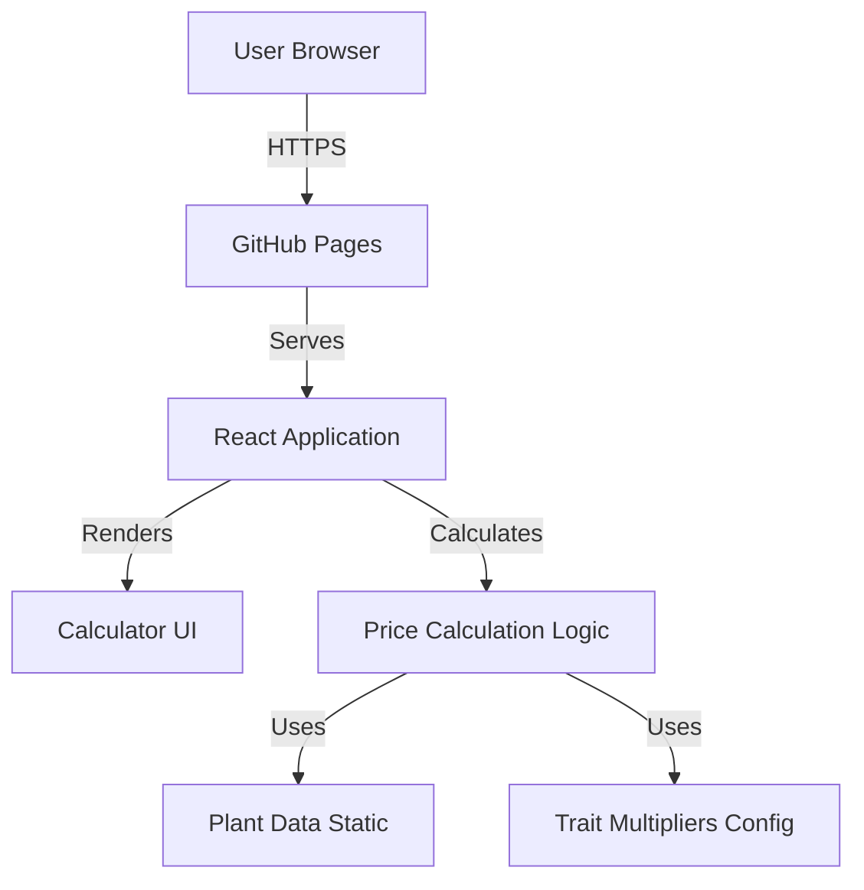
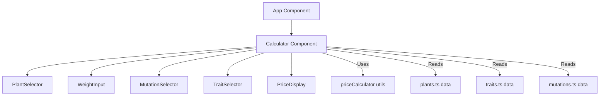
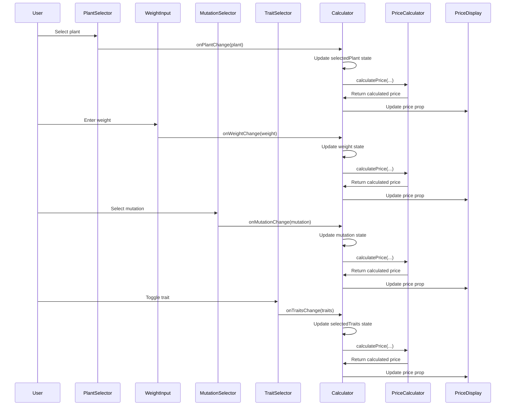

# Plant Price Calculator - System Design

## Architecture Overview
**Cấu trúc hệ thống cấp cao là gì?**

Ứng dụng là một Single Page Application (SPA) tĩnh, chạy hoàn toàn trên client-side:



### Key Components
1. **React Application**: Ứng dụng React đơn giản với các components
2. **Static Data**: Dữ liệu cây trồng và multipliers được hardcode trong code
3. **Calculation Engine**: Logic tính toán giá dựa trên công thức
4. **UI Components**: Giao diện người dùng với form inputs và hiển thị kết quả

### Technology Stack
- **Frontend Framework**: ReactJS (với Create React App hoặc Vite)
- **Styling**: styled-components (theo yêu cầu user rules)
- **Deployment**: GitHub Pages
- **Build Tool**: Vite hoặc CRA (tùy chọn)
- **Language**: TypeScript (khuyến nghị) hoặc JavaScript

## Data Models
**Dữ liệu cần quản lý là gì?**

### Plant Data Structure
```typescript
interface Plant {
  name: string;
  basePrice: number;
}

// Example data
const plants: Plant[] = [
  { name: "Sakura", basePrice: 5 },
  { name: "Saturn Peach", basePrice: 6 },
  { name: "Big-Lip Fruit", basePrice: 7.5 },
  // ... 20 plants total
];
```

### Mutation Types
```typescript
type MutationType = "none" | "gold" | "prismatic";

const mutationMultipliers = {
  none: 1,
  gold: 20,
  prismatic: 50,
};
```

### Trait Configuration
```typescript
interface Trait {
  name: string;
  multiplier: number;
}

const traits: Trait[] = [
  { name: "Dust", multiplier: 10 },
  { name: "Lightning", multiplier: 10 },
  { name: "Rainbow", multiplier: 10 },
  { name: "Terror", multiplier: 10 },
  { name: "Air", multiplier: 5 },
  { name: "Hazy", multiplier: 5 },
  { name: "Cold", multiplier: 3 },
  { name: "Moist", multiplier: 2 },
];

// Tổng tối đa: 10+10+10+10+5+5+3+2 = 55
const MAX_TRAIT_MULTIPLIER = 55;
```

### Calculation State
```typescript
interface CalculatorState {
  selectedPlant: Plant | null;
  weight: number;
  mutation: MutationType;
  selectedTraits: string[]; // Array of trait names
  calculatedPrice: number;
}
```

### Data Flow
1. User selects plant → `selectedPlant` updated → Base price displayed
2. User inputs weight → `weight` updated → Price recalculated
3. User selects mutation → `mutation` updated → Price recalculated
4. User toggles traits → `selectedTraits` updated → Price recalculated
5. Price calculation runs automatically on any state change

### Component Hierarchy
Cấu trúc component tree:



### User Interaction Flow
Sequence diagram cho user interaction:



## API Design
**Các component giao tiếp như thế nào?**

Không có API external. Tất cả logic nằm trong React components và hooks.

### Component Interfaces
```typescript
// Main Calculator Component
interface CalculatorProps {
  // No props needed - self-contained
}

// Plant Selector Component
interface PlantSelectorProps {
  plants: Plant[];
  selectedPlant: Plant | null;
  onPlantChange: (plant: Plant) => void;
}

// Mutation Selector Component
interface MutationSelectorProps {
  mutation: MutationType;
  onMutationChange: (mutation: MutationType) => void;
}

// Trait Selector Component
interface TraitSelectorProps {
  traits: Trait[];
  selectedTraits: string[];
  onTraitsChange: (traits: string[]) => void;
}

// Weight Input Component
interface WeightInputProps {
  weight: number;
  onWeightChange: (weight: number) => void;
}

// Price Display Component
interface PriceDisplayProps {
  price: number;
}
```

## Component Breakdown
**Các khối xây dựng chính là gì?**

### Frontend Components

#### 1. App Component (Root)
- **Responsibility**: Container chính, render Calculator component
- **Location**: `src/App.tsx`
- **State Management**: Không quản lý state (chỉ render)

#### 2. Calculator Component
- **Responsibility**: Component chính chứa toàn bộ logic tính toán
- **Location**: `src/components/Calculator.tsx`
- **Features**:
  - Quản lý state: plant, weight, mutation, traits
  - Tính toán giá tự động
  - Render các sub-components

#### 3. PlantSelector Component
- **Responsibility**: Dropdown để chọn cây
- **Location**: `src/components/PlantSelector.tsx`
- **Features**:
  - Dropdown với danh sách cây
  - Hiển thị base price khi chọn

#### 4. WeightInput Component
- **Responsibility**: Input field cho weight
- **Location**: `src/components/WeightInput.tsx`
- **Features**:
  - Number input với validation
  - Format hiển thị

#### 5. MutationSelector Component
- **Responsibility**: Radio buttons cho mutations (exclusive selection)
- **Location**: `src/components/MutationSelector.tsx`
- **Features**:
  - Gold Mutation radio button (multiplier: 20)
  - Prismatic Mutation radio button (multiplier: 50)
  - None option (default, multiplier: 1)
  - Logic: Exclusive selection - chỉ chọn 1 trong 3 options, không thể chọn cả 2 mutations cùng lúc

#### 6. TraitSelector Component
- **Responsibility**: Checkboxes cho các traits
- **Location**: `src/components/TraitSelector.tsx`
- **Features**:
  - Grid layout với các checkbox
  - Có thể chọn nhiều

#### 7. PriceDisplay Component
- **Responsibility**: Hiển thị giá đã tính
- **Location**: `src/components/PriceDisplay.tsx`
- **Features**:
  - Format số với dấu phẩy
  - Highlight màu đỏ (theo design gốc)

#### 8. Data Files
- **Location**: `src/data/plants.ts`, `src/data/traits.ts`
- **Responsibility**: Static data cho cây và traits

### Utility Functions
- **Location**: `src/utils/priceCalculator.ts`
- **Functions**:
  - `calculatePrice(plant, weight, mutation, traits): number`
  - `formatPrice(price: number): string`

## Design Decisions
**Tại sao chọn cách tiếp cận này?**

### 1. React với Hooks thay vì Class Components
- **Rationale**: Modern, simpler, better performance
- **Alternative**: Class components (outdated)

### 2. styled-components cho styling
- **Rationale**: Theo yêu cầu user rules, ít wrapper, children có className
- **Alternative**: CSS Modules, Tailwind CSS

### 3. Static Data trong Code
- **Rationale**: Không cần backend, dễ maintain, nhanh
- **Alternative**: JSON file, external API (không cần thiết)

### 4. Client-side Calculation
- **Rationale**: Instant feedback, không cần server
- **Alternative**: Server-side API (không cần thiết cho use case này)

### 5. GitHub Pages Deployment
- **Rationale**: Miễn phí, dễ setup, phù hợp static site
- **Alternative**: Netlify, Vercel (cũng miễn phí nhưng GitHub Pages đơn giản hơn)

### Patterns Applied
- **Component Composition**: Tách nhỏ components để dễ maintain
- **Single Responsibility**: Mỗi component có 1 nhiệm vụ rõ ràng
- **Controlled Components**: Tất cả inputs là controlled
- **Derived State**: Price được tính từ state, không lưu riêng

## State Management
**State được quản lý ở đâu?**

### State Location
- **Calculator Component** quản lý tất cả state:
  - `selectedPlant: Plant | null`
  - `weight: number`
  - `mutation: MutationType`
  - `selectedTraits: string[]`
  - `calculatedPrice: number` (derived state, không lưu riêng)
- **App Component** chỉ render Calculator (no state management)
- State được lift lên Calculator để dễ quản lý và tính toán

### State Updates
- Tất cả state updates trigger price recalculation tự động
- Sử dụng `useEffect` để watch state changes và tính toán lại
- `calculatedPrice` là derived state, không cần lưu trong state (có thể tính real-time)

### State Flow
```
User Action → Component Event Handler → State Update → useEffect Trigger → Price Calculation → UI Update
```

## Error Handling & Validation
**Xử lý lỗi và validation như thế nào?**

### Input Validation Rules
- **Weight**: 
  - Phải là số dương (> 0)
  - Chấp nhận số thập phân
  - Nếu <= 0: hiển thị error message, price = 0
- **Plant**: 
  - Phải chọn ít nhất 1 cây
  - Nếu không chọn: disable calculation hoặc show message
- **Mutation**: 
  - Optional (default 'none')
  - Chỉ chọn 1 trong 3 options (none, gold, prismatic)
- **Traits**: 
  - Optional (default empty array)
  - Có thể chọn nhiều
  - Tổng multiplier tự động giới hạn ở 55

### Error States
- **Weight = 0 hoặc < 0**: 
  - Hiển thị inline error message dưới input
  - Highlight input với red border
  - Price = 0 hoặc không hiển thị
- **Không chọn plant**: 
  - Disable calculation
  - Show placeholder message: "Vui lòng chọn cây"
  - Price = 0 hoặc không hiển thị
- **Invalid input format**: 
  - Validate number input
  - Show error message nếu không phải số

### User Feedback
- **Inline error messages**: Hiển thị dưới input fields với màu đỏ
- **Visual indicators**: 
  - Red border cho invalid inputs
  - Disable calculate button khi inputs invalid
- **Error messages**:
  - "Weight phải lớn hơn 0"
  - "Vui lòng chọn cây"
  - "Vui lòng nhập số hợp lệ"

### Edge Cases Handling
- **Weight = 0**: Price = 0, show error
- **Weight < 0**: Treat as invalid, show error
- **Weight = empty string**: Treat as 0, show error
- **No plant selected**: Price = 0, show message
- **No traits selected**: Multiplier = 1 (not 0)
- **No mutation selected**: Multiplier = 1 (default 'none')
- **Trait sum > 55**: Auto-cap at 55, no error (expected behavior)

## Non-Functional Requirements
**Hệ thống nên hoạt động như thế nào?**

### Performance Targets
- **Initial Load**: < 2 giây
- **Calculation Time**: < 100ms
- **Bundle Size**: < 500KB (gzipped)
- **Time to Interactive**: < 3 giây

### Scalability Considerations
- Không cần scale (static site)
- Có thể handle unlimited concurrent users (GitHub Pages CDN)

### Security Requirements
- Không có sensitive data
- Không có user input cần sanitize (chỉ số)
- XSS protection từ React mặc định

### Reliability/Availability Needs
- GitHub Pages uptime: 99.9%
- No single point of failure (static files)
- CDN distribution tự động

### Accessibility
- Keyboard navigation support
- Screen reader friendly
- ARIA labels cho form inputs
- Color contrast đạt WCAG AA

### Browser Compatibility
- Chrome (latest)
- Firefox (latest)
- Safari (latest)
- Edge (latest)
- Mobile browsers (iOS Safari, Chrome Mobile)

